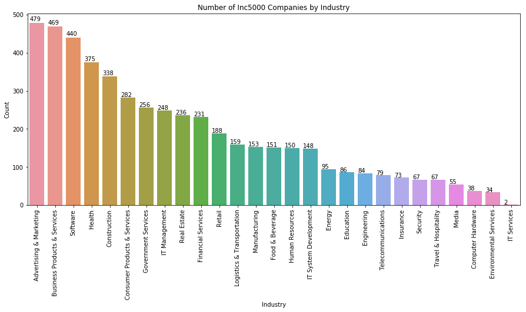
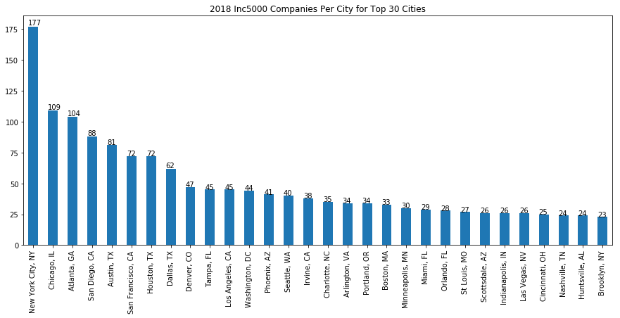
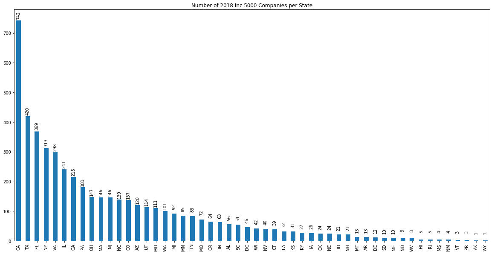
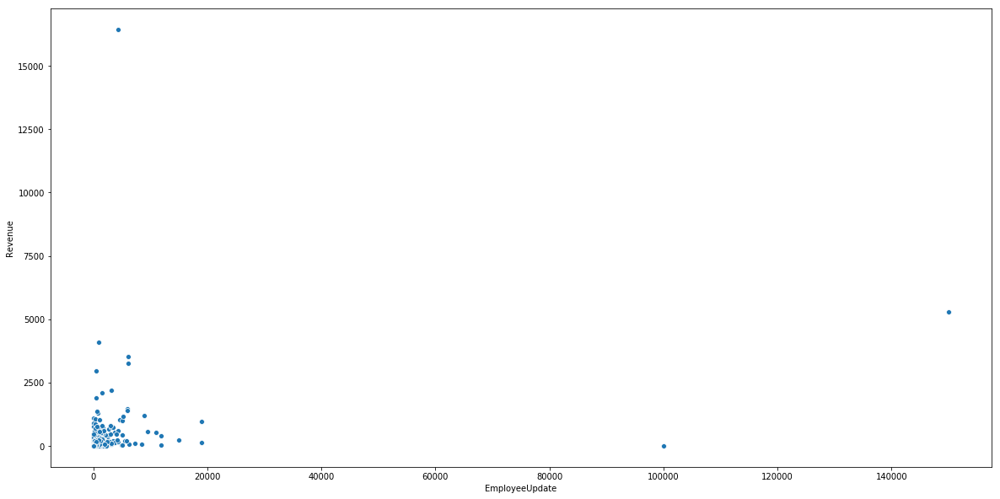

Every year, thousands of companies submit their 3 most recent years of financial information to Inc. magazine/website in the hopes of making it on their Inc. 5000 list of fastest growing private companies in America. In a previous post, I provided a script I put together to extract this data from https://www.inc.com/inc5000/list/2018. In this post, I explore the data and discover some interesting things along with some outliers and mistakes. 

I discovered what seems to be some innacuracies in what was published. More specifically, there are several companies with 0 employees reported. There's another company with $2.3 million in annual revenue and 100,000 employees, which can't be right. 

I also discovered a company based in London and another in Hong Kong. I thought the list only included US companies. 

There are a few interesting plots in this post as well. Enjoy!


```python
#import modules
import pandas as pd
import sqlite3
import matplotlib.pyplot as plt
import seaborn as sns
import numpy as np
%matplotlib inline
#connect to the database and create a dataframe out of the data in the database
conn = sqlite3.connect("inc2018.db")
df = pd.read_sql_query("SELECT * FROM company;", conn)
```

Top 5 Fastest Growing Private Companies


```python
df.head()
```


<div>
<style scoped>
    .dataframe tbody tr th:only-of-type {
        vertical-align: middle;
    }

    .dataframe tbody tr th {
        vertical-align: top;
    }

    .dataframe thead th {
        text-align: right;
    }
</style>
<table border="1" class="dataframe">
  <thead>
    <tr style="text-align: right;">
      <th></th>
      <th>index</th>
      <th>Rank</th>
      <th>CompanyName</th>
      <th>Leadership</th>
      <th>2017Revenue</th>
      <th>Industry</th>
      <th>Founded</th>
      <th>Growth</th>
      <th>Location</th>
      <th>Employees</th>
    </tr>
  </thead>
  <tbody>
    <tr>
      <th>0</th>
      <td>0</td>
      <td>#1</td>
      <td>SwanLeap</td>
      <td>Brad Hollister</td>
      <td>$99 M</td>
      <td>Logistics &amp; Transportation</td>
      <td>2013</td>
      <td>75,661%</td>
      <td>Madison, WI</td>
      <td>49</td>
    </tr>
    <tr>
      <th>1</th>
      <td>1</td>
      <td>#2</td>
      <td>PopSockets</td>
      <td>David Barnett</td>
      <td>$168.8 M</td>
      <td>Consumer Products &amp; Services</td>
      <td>2010</td>
      <td>71,424%</td>
      <td>Boulder, CO</td>
      <td>118</td>
    </tr>
    <tr>
      <th>2</th>
      <td>2</td>
      <td>#3</td>
      <td>Home Chef</td>
      <td>Patrick Vihtelic</td>
      <td>$255 M</td>
      <td>Food &amp; Beverage</td>
      <td>2013</td>
      <td>60,166%</td>
      <td>Chicago, IL</td>
      <td>865</td>
    </tr>
    <tr>
      <th>3</th>
      <td>3</td>
      <td>#4</td>
      <td>Velocity Global</td>
      <td>Ben Wright</td>
      <td>$49.2 M</td>
      <td>Business Products &amp; Services</td>
      <td>2013</td>
      <td>39,817%</td>
      <td>Denver, CO</td>
      <td>78</td>
    </tr>
    <tr>
      <th>4</th>
      <td>4</td>
      <td>#5</td>
      <td>DEPCOM Power</td>
      <td>Jim Lamon</td>
      <td>$219.6 M</td>
      <td>Energy</td>
      <td>2013</td>
      <td>38,963%</td>
      <td>Scottsdale, AZ</td>
      <td>104</td>
    </tr>
  </tbody>
</table>
</div>


### Preparing the data for analysis

For any attribute in which the script is not able to find the html tag it is looking for, the script outputs "couldn't find". Below I will look for all rows that contain "couldn't find" in any of the fields.


```python
cant_find = df[df.apply(lambda row: row.astype(str).str.contains("couldn't find").any(), axis=1)]
cant_find
```


<div>
<style scoped>
    .dataframe tbody tr th:only-of-type {
        vertical-align: middle;
    }

    .dataframe tbody tr th {
        vertical-align: top;
    }

    .dataframe thead th {
        text-align: right;
    }
</style>
<table border="1" class="dataframe">
  <thead>
    <tr style="text-align: right;">
      <th></th>
      <th>index</th>
      <th>Rank</th>
      <th>CompanyName</th>
      <th>Leadership</th>
      <th>2017Revenue</th>
      <th>Industry</th>
      <th>Founded</th>
      <th>Growth</th>
      <th>Location</th>
      <th>Employees</th>
    </tr>
  </thead>
  <tbody>
    <tr>
      <th>71</th>
      <td>71</td>
      <td>couldn't find</td>
      <td>ConvertKit</td>
      <td>Nathan Barry, 27</td>
      <td>couldn't find</td>
      <td>Software</td>
      <td>2013</td>
      <td>couldn't find</td>
      <td>Boise, ID</td>
      <td>30</td>
    </tr>
    <tr>
      <th>267</th>
      <td>267</td>
      <td>couldn't find</td>
      <td>Stukent</td>
      <td>Stuart Draper</td>
      <td>couldn't find</td>
      <td>Education</td>
      <td>2013</td>
      <td>couldn't find</td>
      <td>Idaho Falls, ID</td>
      <td>48</td>
    </tr>
    <tr>
      <th>414</th>
      <td>414</td>
      <td>couldn't find</td>
      <td>Lync America</td>
      <td>Cynthia Lee</td>
      <td>couldn't find</td>
      <td>Logistics &amp; Transportation</td>
      <td>2014</td>
      <td>couldn't find</td>
      <td>Chattanooga, TN</td>
      <td>27</td>
    </tr>
    <tr>
      <th>997</th>
      <td>997</td>
      <td>couldn't find</td>
      <td>Proximity Learning Inc.</td>
      <td>Evan Erdberg</td>
      <td>couldn't find</td>
      <td>Education</td>
      <td>2009</td>
      <td>couldn't find</td>
      <td>Austin, TX</td>
      <td>150</td>
    </tr>
    <tr>
      <th>1339</th>
      <td>1339</td>
      <td>couldn't find</td>
      <td>404 Page Not Found</td>
      <td>couldn't find</td>
      <td>couldn't find</td>
      <td>couldn't find</td>
      <td>couldn't find</td>
      <td>couldn't find</td>
      <td>couldn't find</td>
      <td>couldn't find</td>
    </tr>
    <tr>
      <th>1569</th>
      <td>1569</td>
      <td>couldn't find</td>
      <td>pNeo</td>
      <td>Peter Wenham</td>
      <td>couldn't find</td>
      <td>Consumer Products &amp; Services</td>
      <td>2008</td>
      <td>couldn't find</td>
      <td>Denton, TX</td>
      <td>15</td>
    </tr>
    <tr>
      <th>1693</th>
      <td>1693</td>
      <td>couldn't find</td>
      <td>KingPay</td>
      <td>Ron Singh</td>
      <td>couldn't find</td>
      <td>Financial Services</td>
      <td>2013</td>
      <td>couldn't find</td>
      <td>London , United Kingdom</td>
      <td>50</td>
    </tr>
    <tr>
      <th>2251</th>
      <td>2251</td>
      <td>couldn't find</td>
      <td>404 Page Not Found</td>
      <td>couldn't find</td>
      <td>couldn't find</td>
      <td>couldn't find</td>
      <td>couldn't find</td>
      <td>couldn't find</td>
      <td>couldn't find</td>
      <td>couldn't find</td>
    </tr>
    <tr>
      <th>2351</th>
      <td>2351</td>
      <td>couldn't find</td>
      <td>Greenback Tax Services</td>
      <td>Carrie McKeegan</td>
      <td>couldn't find</td>
      <td>Financial Services</td>
      <td>2008</td>
      <td>couldn't find</td>
      <td>Mong Kok, Hong Kong</td>
      <td>50</td>
    </tr>
    <tr>
      <th>2485</th>
      <td>2485</td>
      <td>couldn't find</td>
      <td>EvoText</td>
      <td>Johanna Wetmore</td>
      <td>couldn't find</td>
      <td>Software</td>
      <td>2014</td>
      <td>couldn't find</td>
      <td>Burlington, MA</td>
      <td>Small (25 - 49)</td>
    </tr>
    <tr>
      <th>2582</th>
      <td>2582</td>
      <td>couldn't find</td>
      <td>ITinspired</td>
      <td>Robert Wise</td>
      <td>$147.3 M</td>
      <td>IT Services</td>
      <td>2011</td>
      <td>151%</td>
      <td>Baton Rouge, LA</td>
      <td>Micro (10 - 24)</td>
    </tr>
    <tr>
      <th>2791</th>
      <td>2791</td>
      <td>couldn't find</td>
      <td>Nationwide Transport Services, LLC</td>
      <td>Jason Foltz</td>
      <td>couldn't find</td>
      <td>Logistics &amp; Transportation</td>
      <td>2009</td>
      <td>couldn't find</td>
      <td>Fort Lauderdale, FL</td>
      <td>20</td>
    </tr>
    <tr>
      <th>2857</th>
      <td>2857</td>
      <td>couldn't find</td>
      <td>Beehive Plumbing</td>
      <td>Matthew Naylor</td>
      <td>couldn't find</td>
      <td>Construction</td>
      <td>1999</td>
      <td>couldn't find</td>
      <td>West Jordan, UT</td>
      <td>24</td>
    </tr>
    <tr>
      <th>4364</th>
      <td>4364</td>
      <td>#3854</td>
      <td>Surface Mount Technology</td>
      <td>couldn't find</td>
      <td>$14.3 M</td>
      <td>Manufacturing</td>
      <td>1997</td>
      <td>68%</td>
      <td>Appleton, WI</td>
      <td>130</td>
    </tr>
    <tr>
      <th>4660</th>
      <td>4660</td>
      <td>couldn't find</td>
      <td>404 Page Not Found</td>
      <td>couldn't find</td>
      <td>couldn't find</td>
      <td>couldn't find</td>
      <td>couldn't find</td>
      <td>couldn't find</td>
      <td>couldn't find</td>
      <td>couldn't find</td>
    </tr>
    <tr>
      <th>4971</th>
      <td>4971</td>
      <td>couldn't find</td>
      <td>Insight Global</td>
      <td>Bert Bean</td>
      <td>$1928.8 M</td>
      <td>Business Products &amp; Services</td>
      <td>2001</td>
      <td>58%</td>
      <td>Atlanta, GA</td>
      <td>2570</td>
    </tr>
  </tbody>
</table>
</div>


There are 16 company profiles for which the script was not able to extract at least one of the fields. 

The reason that the script was not able to find some of the data is because of inconsistencies in the tags used to identify attribute types in the company profiles. For example, in the image below, you can see that revenue is presented in multiple ways.

Also, it appears the script may have ran into some broken links, indicated by the rows with "404 Page Not Found" in the CompanyName field.

Fortunately, the script was able to capture all the data for all but 16 companies. In order to make sure the script is able to collect all the information, I would have to account for these inconsistencies. For now, I will create a new dataframe with these removed from the data set.


```python
df2 = df.drop(cant_find.index, axis = 0)
```

To view the data type of each field


```python
df2.info()
```

    <class 'pandas.core.frame.DataFrame'>
    Int64Index: 4983 entries, 0 to 4998
    Data columns (total 10 columns):
    index          4983 non-null int64
    Rank           4983 non-null object
    CompanyName    4983 non-null object
    Leadership     4983 non-null object
    2017Revenue    4983 non-null object
    Industry       4983 non-null object
    Founded        4983 non-null object
    Growth         4983 non-null object
    Location       4983 non-null object
    Employees      4983 non-null object
    dtypes: int64(1), object(9)
    memory usage: 428.2+ KB
    

We need to convert some of the attributes to numeric data types. These attributes are '2017Revenue', 'Growth', 'Founded', and 'Employees'. 


```python
df2["Revenue"] = pd.to_numeric(df2["2017Revenue"].apply(lambda x: 0 if x == "couldn't find" else x[1:-2]))

df2["Founded"] = pd.to_datetime(df2["Founded"].apply(lambda x: 0 if x == "couldn't find" else x)).dt.year

df2["GrowthPercent"] = pd.to_numeric(df2.Growth.apply(lambda x: 0 if x == "couldn't find" else x[:-1].replace(',', '')))
```

Some of the values in the 'Employees' attribute are provided as a range, which you can see below. 


```python
df2.iloc[[8]]
```


<div>
<style scoped>
    .dataframe tbody tr th:only-of-type {
        vertical-align: middle;
    }

    .dataframe tbody tr th {
        vertical-align: top;
    }

    .dataframe thead th {
        text-align: right;
    }
</style>
<table border="1" class="dataframe">
  <thead>
    <tr style="text-align: right;">
      <th></th>
      <th>index</th>
      <th>Rank</th>
      <th>CompanyName</th>
      <th>Leadership</th>
      <th>2017Revenue</th>
      <th>Industry</th>
      <th>Founded</th>
      <th>Growth</th>
      <th>Location</th>
      <th>Employees</th>
      <th>Revenue</th>
      <th>GrowthPercent</th>
    </tr>
  </thead>
  <tbody>
    <tr>
      <th>8</th>
      <td>8</td>
      <td>#8</td>
      <td>Flexport</td>
      <td>Ryan Petersen</td>
      <td>$224.7 M</td>
      <td>Logistics &amp; Transportation</td>
      <td>2013</td>
      <td>15,911%</td>
      <td>San Francisco, CA</td>
      <td>Large (250 - 499)</td>
      <td>224.7</td>
      <td>15911</td>
    </tr>
  </tbody>
</table>
</div>


In order to convert the 'Employees' attribute to numeric, I will extract the upper number provided in the range for these types of values. To extract the upper value in the Employee counts provided as a range.


```python
def dash(s):
    if s.find("-") != -1:
        return s[s.find("- ") + 2:-1]
    else:
        return s
df2["EmployeeUpdate"] = df2.Employees.apply(dash)
df2["EmployeeUpdate"] = pd.to_numeric(df2.EmployeeUpdate.apply(lambda x: 0 if x == "couldn't find" else x))
```

Looking at the data types of each field after the above operations.


```python
df2.info()
```

    <class 'pandas.core.frame.DataFrame'>
    Int64Index: 4983 entries, 0 to 4998
    Data columns (total 13 columns):
    index             4983 non-null int64
    Rank              4983 non-null object
    CompanyName       4983 non-null object
    Leadership        4983 non-null object
    2017Revenue       4983 non-null object
    Industry          4983 non-null object
    Founded           4983 non-null int64
    Growth            4983 non-null object
    Location          4983 non-null object
    Employees         4983 non-null object
    Revenue           4983 non-null float64
    GrowthPercent     4983 non-null int64
    EmployeeUpdate    4983 non-null int64
    dtypes: float64(1), int64(4), object(8)
    memory usage: 545.0+ KB
    

### Plots

Number of Companies by Industry


```python
a4_dims = (15, 6)
fig, ax = plt.subplots(figsize=a4_dims)
sns.countplot(df2.Industry, ax = ax, order= df2.Industry.value_counts().index)
plt.xticks(rotation=90)
plt.ylabel("Count")
plt.title("Number of Inc5000 Companies by Industry")
for p in ax.patches:
    ax.annotate(str(p.get_height()), (p.get_x() * 1.0, p.get_height() * 1.01))
```





Number of Companies per City (top 30)


```python
ax = df2.Location.value_counts().sort_values(ascending=False).head(30).plot.bar(figsize=a4_dims, title="2018 Inc5000 Companies Per City for Top 30 Cities")
for p in ax.patches:
    ax.annotate(str(p.get_height()), (p.get_x() * 1.0, p.get_height() * 1.01))
```





Number of Companies per State


```python
# Have to create a "State" attribute by extracting the last two characters of the "Location" attribute
df2['State'] = df2["Location"].apply(lambda x: x[-2:])
aa = df2.State.value_counts().plot.bar(figsize=(20,10), title = "Number of 2018 Inc 5000 Companies per State")
for p in aa.patches:
    aa.annotate(str(p.get_height()), (p.get_x() * 1.0, p.get_height() + 20), rotation=90)
```





Growth Versus Revenue Scatterplot


```python
a4_dims = (20, 10)
fig, ax = plt.subplots(figsize=a4_dims)
sns.scatterplot(x="EmployeeUpdate", y="Revenue", data=df2, ax=ax)
```


    <matplotlib.axes._subplots.AxesSubplot at 0x22e1a5a82e8>





There are a few companies that look like outliers. There is one in particular that stands out a lot. The point with about 100,000 employees but close to 0 revenue. Let's take a look at this one.


```python
df2[(df2.EmployeeUpdate > 90000) & (df2.EmployeeUpdate < 110000)]
```


<div>
<style scoped>
    .dataframe tbody tr th:only-of-type {
        vertical-align: middle;
    }

    .dataframe tbody tr th {
        vertical-align: top;
    }

    .dataframe thead th {
        text-align: right;
    }
</style>
<table border="1" class="dataframe">
  <thead>
    <tr style="text-align: right;">
      <th></th>
      <th>index</th>
      <th>Rank</th>
      <th>CompanyName</th>
      <th>Leadership</th>
      <th>2017Revenue</th>
      <th>Industry</th>
      <th>Founded</th>
      <th>Growth</th>
      <th>Location</th>
      <th>Employees</th>
      <th>Revenue</th>
      <th>GrowthPercent</th>
      <th>EmployeeUpdate</th>
      <th>State</th>
    </tr>
  </thead>
  <tbody>
    <tr>
      <th>1682</th>
      <td>1682</td>
      <td>#1684</td>
      <td>Alorica</td>
      <td>Andy Lee</td>
      <td>$2.3 M</td>
      <td>Business Products &amp; Services</td>
      <td>1999</td>
      <td>273%</td>
      <td>Irvine, CA</td>
      <td>100000</td>
      <td>2.3</td>
      <td>273</td>
      <td>100000</td>
      <td>CA</td>
    </tr>
  </tbody>
</table>
</div>


Alcoria has 100,000 employees but only $2.3M in revenue. This doesn't seem right. However, as you can see in the image below, that is exactly what is provided in their Inc.com profile.


Some companies have a value of zero employees in their profile.


```python
df2[df2.Employees == '0']
```


<div>
<style scoped>
    .dataframe tbody tr th:only-of-type {
        vertical-align: middle;
    }

    .dataframe tbody tr th {
        vertical-align: top;
    }

    .dataframe thead th {
        text-align: right;
    }
</style>
<table border="1" class="dataframe">
  <thead>
    <tr style="text-align: right;">
      <th></th>
      <th>index</th>
      <th>Rank</th>
      <th>CompanyName</th>
      <th>Leadership</th>
      <th>2017Revenue</th>
      <th>Industry</th>
      <th>Founded</th>
      <th>Growth</th>
      <th>Location</th>
      <th>Employees</th>
      <th>Revenue</th>
      <th>GrowthPercent</th>
      <th>EmployeeUpdate</th>
      <th>State</th>
    </tr>
  </thead>
  <tbody>
    <tr>
      <th>1973</th>
      <td>1973</td>
      <td>#1975</td>
      <td>MJ Freeway</td>
      <td>Amy Poinsett</td>
      <td>$8.1 M</td>
      <td>Software</td>
      <td>2010</td>
      <td>226%</td>
      <td>Denver, CO</td>
      <td>0</td>
      <td>8.1</td>
      <td>226</td>
      <td>0</td>
      <td>CO</td>
    </tr>
    <tr>
      <th>2267</th>
      <td>2267</td>
      <td>#2270</td>
      <td>Playags</td>
      <td>David Lopez</td>
      <td>$212 M</td>
      <td>Business Products &amp; Services</td>
      <td>2005</td>
      <td>194%</td>
      <td>Las Vegas, NV</td>
      <td>0</td>
      <td>212.0</td>
      <td>194</td>
      <td>0</td>
      <td>NV</td>
    </tr>
    <tr>
      <th>2899</th>
      <td>2899</td>
      <td>#2902</td>
      <td>Grand Power Systems</td>
      <td>Stephen Paul</td>
      <td>$29.5 M</td>
      <td>Energy</td>
      <td>1948</td>
      <td>141%</td>
      <td>Grand Haven, MI</td>
      <td>0</td>
      <td>29.5</td>
      <td>141</td>
      <td>0</td>
      <td>MI</td>
    </tr>
    <tr>
      <th>3158</th>
      <td>3158</td>
      <td>#3161</td>
      <td>BayCom</td>
      <td>George Guarini</td>
      <td>$44.3 M</td>
      <td>Financial Services</td>
      <td>2004</td>
      <td>125%</td>
      <td>Walnut Creek, CA</td>
      <td>0</td>
      <td>44.3</td>
      <td>125</td>
      <td>0</td>
      <td>CA</td>
    </tr>
    <tr>
      <th>3434</th>
      <td>3434</td>
      <td>#3437</td>
      <td>Peddle</td>
      <td>Tim Yarosh</td>
      <td>$65.6 M</td>
      <td>Consumer Products &amp; Services</td>
      <td>2011</td>
      <td>111%</td>
      <td>Austin, TX</td>
      <td>0</td>
      <td>65.6</td>
      <td>111</td>
      <td>0</td>
      <td>TX</td>
    </tr>
    <tr>
      <th>3435</th>
      <td>3435</td>
      <td>#3438</td>
      <td>E-file.com</td>
      <td>Aaron Rosenthal and Robert Reynard</td>
      <td>$5.1 M</td>
      <td>Consumer Products &amp; Services</td>
      <td>2011</td>
      <td>111%</td>
      <td>Ponte Vedra, FL</td>
      <td>0</td>
      <td>5.1</td>
      <td>111</td>
      <td>0</td>
      <td>FL</td>
    </tr>
    <tr>
      <th>4066</th>
      <td>4066</td>
      <td>#4069</td>
      <td>Bridgewater Bancshares</td>
      <td>Jerry Baack</td>
      <td>$52.5 M</td>
      <td>Financial Services</td>
      <td>2005</td>
      <td>86%</td>
      <td>Bloomington, MN</td>
      <td>0</td>
      <td>52.5</td>
      <td>86</td>
      <td>0</td>
      <td>MN</td>
    </tr>
    <tr>
      <th>4776</th>
      <td>4776</td>
      <td>#4778</td>
      <td>Ellison Bakery</td>
      <td>Todd Wallin</td>
      <td>$29.9 M</td>
      <td>Food &amp; Beverage</td>
      <td>1945</td>
      <td>64%</td>
      <td>Ft. Wayne, IN</td>
      <td>0</td>
      <td>29.9</td>
      <td>64</td>
      <td>0</td>
      <td>IN</td>
    </tr>
    <tr>
      <th>4822</th>
      <td>4822</td>
      <td>#4824</td>
      <td>Quality Aluminum Products</td>
      <td>Bob Clark</td>
      <td>$45 M</td>
      <td>Manufacturing</td>
      <td>1990</td>
      <td>63%</td>
      <td>Hastings, MI</td>
      <td>0</td>
      <td>45.0</td>
      <td>63</td>
      <td>0</td>
      <td>MI</td>
    </tr>
    <tr>
      <th>4951</th>
      <td>4951</td>
      <td>#4953</td>
      <td>Custom Profile</td>
      <td>John Boeschenstein</td>
      <td>$48.3 M</td>
      <td>Manufacturing</td>
      <td>1992</td>
      <td>59%</td>
      <td>Grand Rapids, MI</td>
      <td>0</td>
      <td>48.3</td>
      <td>59</td>
      <td>0</td>
      <td>MI</td>
    </tr>
    <tr>
      <th>4977</th>
      <td>4977</td>
      <td>#4979</td>
      <td>Mediassociates</td>
      <td>Scott Brunjes</td>
      <td>$11.5 M</td>
      <td>Advertising &amp; Marketing</td>
      <td>1996</td>
      <td>58%</td>
      <td>Sandy Hook, CT</td>
      <td>0</td>
      <td>11.5</td>
      <td>58</td>
      <td>0</td>
      <td>CT</td>
    </tr>
  </tbody>
</table>
</div>


The image below confirms that the script pulled the data as is provided in the profile.


Creating a new dataframe for companies with greater than zero employees


```python
df3 = df2[df2.EmployeeUpdate > 0]
```

### Comparing Statistics by Industry

A traditional heatmap must have the same unit of measurement in every cell. Below is a function that accepts a pandas grouped by object and creates a heatmap where each column in the heatmap is based on its own unique scale. This gives us the visual benefit of a heatmap while also allowing us to compare the different industries along different statistical dimensions. 


```python
def groupedHeatMap(groupedObject, cmap = "YlGnBu", title = ''):
    import shutil
    index_values = groupedObject.index.values
    a5_dims = (15, 12)
    fig, ax =plt.subplots(1,len(groupedObject.columns), figsize=a5_dims)
    for i in np.arange(len(groupedObject.columns)):
        stat = groupedObject[groupedObject.columns[i]].sort_index()
        if i == 0:
            sns.heatmap(stat.to_frame(),ax=ax[0], cbar=False, cmap=cmap, linewidths=2)
            for j in range(len(index_values)):
                text = ax[0].text(.5,j+.5, str(int(stat.iloc[j])), ha="center", va="center", color="w")
        else:
            sns.heatmap(stat.to_frame(),ax=ax[i], cbar=False, cmap=cmap, linewidths=2)
            ax[i].set_yticklabels(ax[i].get_yticklabels(), fontsize=0)
            ax[i].set_ylabel("")
            ax[i].yaxis.set_visible(False)
            for j in range(len(index_values)):
                text = ax[i].text(.5,j+.5, str(int(stat.iloc[j])), ha="center", va="center", color="w")
    plt.subplots_adjust(wspace = .001)
    columns = shutil.get_terminal_size().columns
    print(title.center(columns))
    fig.show()
```

Using the newly created function


```python
rev_stats = df3[df3.Revenue > 0].groupby("Industry").agg(['mean', 'std', 'count', 'max', 'min', 'sum']).Revenue
groupedHeatMap(rev_stats, title="Revenue Statistics by Industry (In Millions)")
```

                                          Revenue Statistics by Industry (In Millions)                                      
    


